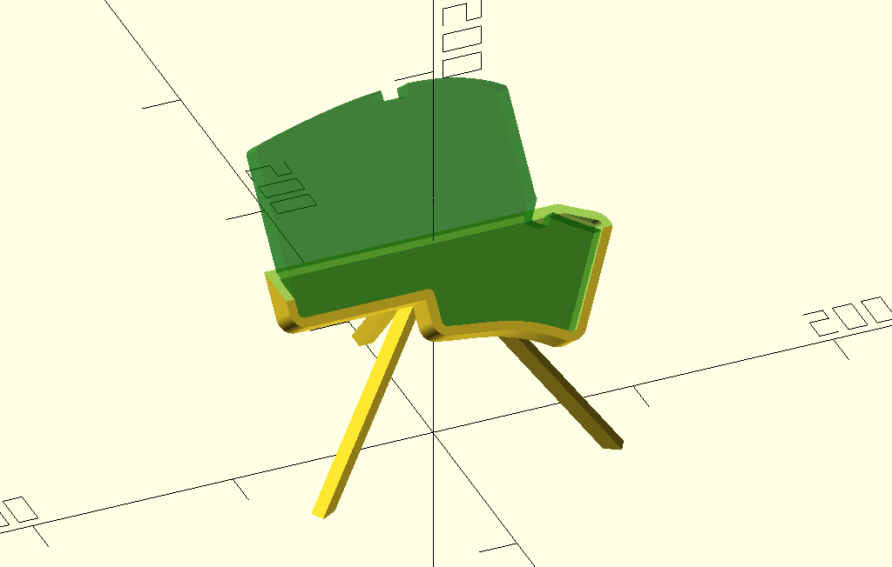

# Iris Keyboard Holder

A display holder for Keebio's Iris keyboard. The Iris is fairly awkward to fit into the other keyboard stands I've found on Printables due to the shape of the bottom, and so I felt the need to create my own.

The design consists of a tripod and a saddle offset from the [Iris bottom plate design provided by Keebio](https://github.com/keebio/iris-case/blob/master/older-designs/rev2-only/iris-bottom-plate.svg) (MIT Licensed).

The design is parameterized, and variables at the top of [the file](iris-display-holder.scad) can be adjusted for a variety of customizations (display angle, thicker tripod legs, splay angle of tripod, height to the point at which the tripod attaches to the saddle, saddle rim size, etc), and it may be possible to swap the svg of the outline of the keyboard with other keyboards (or objects). I've tried to line the center of mass roughly with the convergence point of the tripod legs.

This is on my 3d print queue, I haven't yet tested it. Once I have, I will publish to Printables and update this README.

This model is for the left hand side of the Iris. Since the Iris is symmetrical, I recommend mirroring the part in your slicer to print the right hand side.
